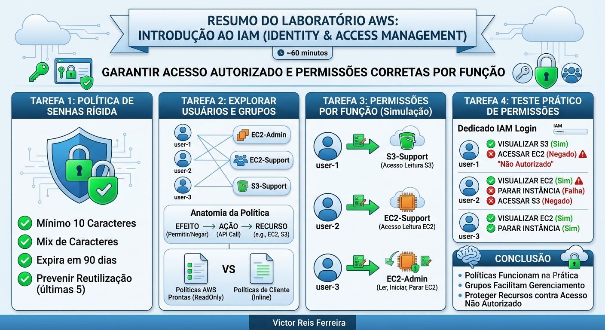
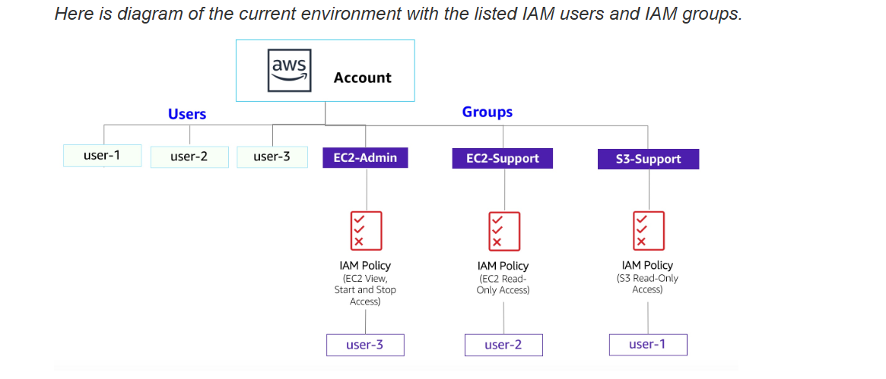
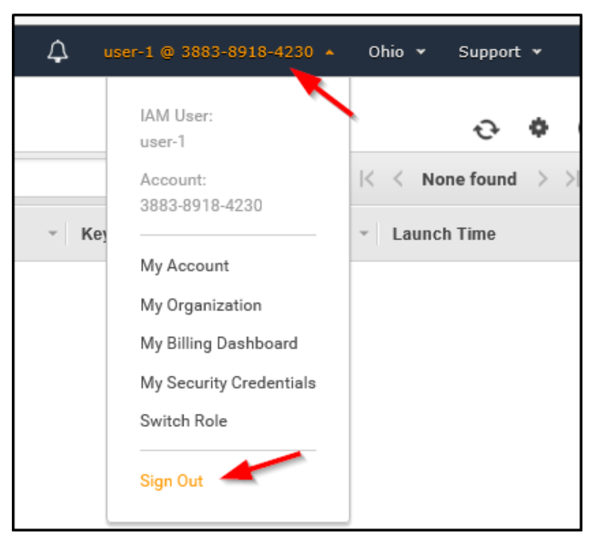
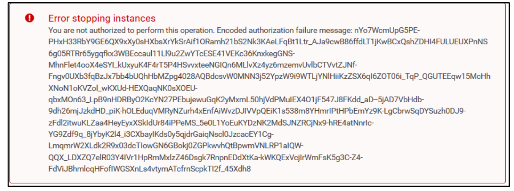
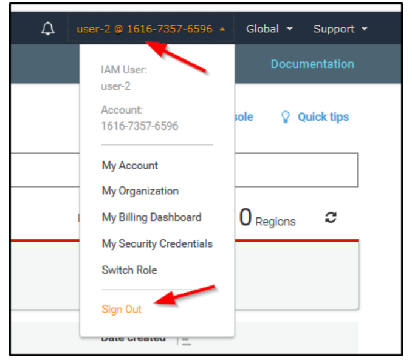
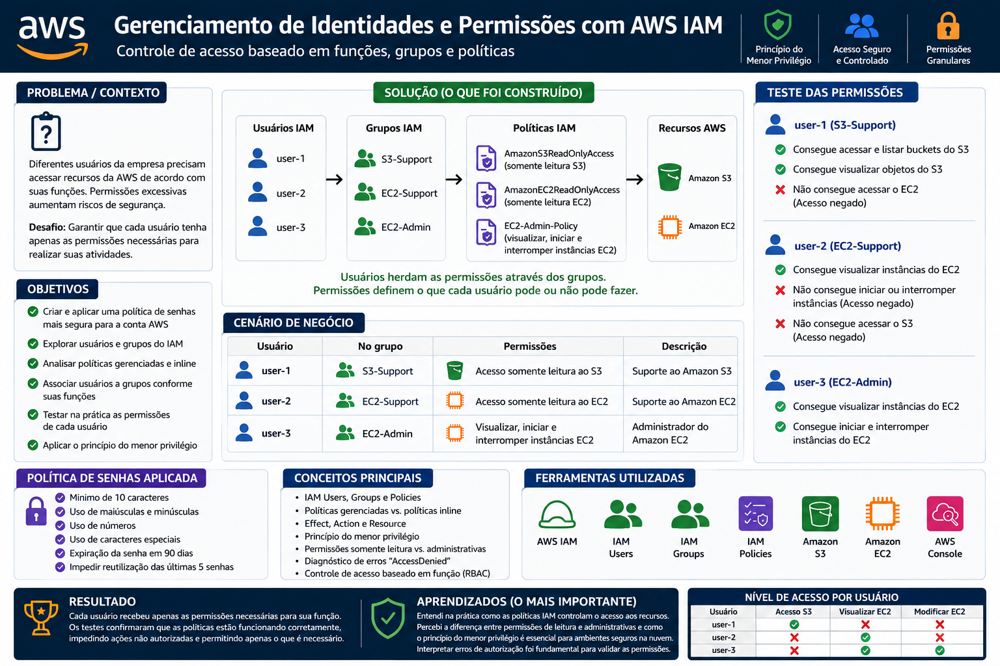

# Gerenciamento de Identidades e Permissões com AWS IAM

Em ambientes de computação em nuvem, diferentes profissionais precisam acessar os recursos da AWS de acordo com suas responsabilidades. Conceder permissões excessivas pode representar um risco de segurança, enquanto permissões insuficientes podem impedir que uma equipe execute suas atividades.

Neste laboratório, o objetivo foi simular um cenário empresarial no qual diferentes usuários possuem funções distintas relacionadas ao gerenciamento de recursos do **Amazon S3** e **Amazon EC2**.

O cenário utilizou três usuários:

- `user-1` → Suporte ao Amazon S3
- `user-2` → Suporte ao Amazon EC2
- `user-3` → Administrador do Amazon EC2

A partir dessas funções, cada usuário deveria receber somente as permissões necessárias para realizar suas atividades.

## Objetivo

O objetivo foi aprender, na prática, como utilizar o **AWS IAM (Identity and Access Management)** para:

- Criar e aplicar uma política de senhas para a conta AWS;
- Explorar usuários e grupos do **IAM**;
- Entender como políticas definem permissões;
- Diferenciar políticas gerenciadas e políticas inline;
- Associar usuários a grupos de acordo com suas funções;
- Aplicar diferentes níveis de acesso aos serviços AWS;
- Testar na prática o que cada usuário pode ou não fazer;
- Compreender a importância do **princípio do menor privilégio**.

## Solução

Foi criado um cenário de controle de acesso utilizando AWS IAM, estruturado de acordo com as funções dos usuários.

### 1. Configuração da política de senhas

A política de senhas da conta AWS foi fortalecida para exigir requisitos mais rígidos, incluindo:

Mínimo de **10 caracteres**;
Uso de caracteres especiais;
Exigência de caracteres numéricos;
Exigência de letras maiúsculas e minúsculas;
Expiração de senha após **90 dias**;
Impedimento do reutilização das últimas **5 senhas**.

Essa configuração estabelece um padrão de segurança para as credenciais dos usuários associados à conta.

### 2. Análise dos usuários e grupos

Foram analisados os usuários previamente criados no ambiente:

- `user-1`
- `user-2`
- `user-3`

Também foram analisados os grupos:

- `S3-Support`
- `EC2-Support`
- `EC2-Admin`

Durante a análise, foi possível verificar que os usuários inicialmente não possuíam permissões diretamente atribuídas e que os acessos seriam concedidos através dos grupos.

Essa abordagem facilita o gerenciamento das permissões, pois os privilégios podem ser associados ao grupo e posteriormente herdados pelos usuários pertencentes a ele.

### 3. Análise das políticas IAM

Foram analisadas diferentes políticas associadas aos grupos.

#### **S3-Support**

O grupo possui a política:

`AmazonS3ReadOnlyAccess`

Essa política permite consultar e listar recursos do Amazon S3, sem permitir alterações.

**Objetivo:** fornecer acesso de suporte ao armazenamento sem conceder permissões administrativas.

#### **EC2-Support**

O grupo possui a política:

`AmazonEC2ReadOnlyAccess`

Essa política permite visualizar informações relacionadas ao Amazon EC2 e outros recursos relacionados, mas não permite realizar alterações.

**Objetivo:** permitir que uma equipe de suporte consulte os recursos sem poder modificá-los.

#### **EC2-Admin**

O grupo possui uma política inline chamada:

`EC2-Admin-Policy`

Essa política concede permissões para visualizar informações do EC2 e realizar ações específicas, como:

- Visualizar informações das instâncias;
- Iniciar instâncias;
- Interromper instâncias.

**Objetivo:** fornecer ao administrador do EC2 permissões suficientes para gerenciar as instâncias.

### 4. Associação dos usuários aos grupos

Os usuários foram associados aos grupos de acordo com suas respectivas funções:

**Usuário** |	**Grupo** |	**Permissões**
----|----|----
user-1 |	S3-Support |	Acesso somente leitura ao S3
user-2 |	EC2-Support |	Acesso somente leitura ao EC2
user-3 |	EC2-Admin |	Visualizar, iniciar e interromper instâncias EC2

Essa estrutura permite organizar as permissões de acordo com a função exercida pelo usuário.

### 5. Teste das permissões

Após configurar os grupos, foi realizado o login utilizando cada usuário para verificar se as políticas estavam funcionando conforme esperado.

`user-1` — **S3 Support**

O usuário conseguiu:

- Acessar o Amazon S3;
- Visualizar os buckets;
- Navegar pelo conteúdo dos buckets.

Porém, ao tentar acessar o Amazon EC2, recebeu uma mensagem informando que não possuía autorização para realizar a operação.

**Resultado esperado:** acesso ao S3, sem acesso ao EC2.

`user-2` — **EC2 Support**

O usuário conseguiu:

- Acessar o Amazon EC2;
- Visualizar as instâncias;
- Consultar informações dos recursos.

Porém, ao tentar interromper uma instância, recebeu um erro informando que não possuía autorização para realizar essa operação.

Também não conseguiu listar os buckets do Amazon S3.

**Resultado esperado:** acesso de leitura ao EC2, sem permissão para modificar recursos e sem acesso ao S3.

`user-3` — **EC2 Admin**

O usuário conseguiu:

- Acessar o Amazon EC2;
- Visualizar as instâncias;
- Interromper uma instância EC2.

A instância passou para o estado `Stopping`, demonstrando que a política administrativa estava permitindo a ação.

**Resultado esperado:** acesso de gerenciamento às ações definidas pela política do grupo `EC2-Admin`.

## Ferramentas

- **AWS IAM** — gerenciamento de identidades, usuários, grupos e permissões;
- **Amazon EC2** — recurso utilizado para validar as permissões de acesso;
- **Amazon S3** — recurso utilizado para validar permissões de armazenamento;
- **IAM Policies** — definição das ações permitidas ou negadas;
- **IAM Users** — representação das identidades dos usuários;
- **IAM User Groups** — organização dos usuários de acordo com suas funções;
- **AWS Management Console** — gerenciamento e testes do ambiente.

## Resultado

O laboratório foi concluído com sucesso.

Foi possível criar uma política de senhas mais rigorosa, analisar diferentes tipos de políticas IAM, organizar usuários em grupos e testar na prática os efeitos das permissões.

Os testes demonstraram claramente a diferença entre os níveis de acesso:

**Usuário** |	**S3** |	**Visualizar EC2** |	**Modificar EC2**
:----:|:----:|:----:|:----:
`user-1` |	✅ |	❌ |	❌
`user-2` |	❌ |	✅ |	❌
`user-3` |	❌ |	✅ |	✅

Dessa forma, cada usuário recebeu permissões compatíveis com sua função, evitando que todos tivessem acesso administrativo aos recursos.

## Aprendizados — O mais importante

Este laboratório foi importante para compreender que **gerenciar permissões na nuvem não significa simplesmente permitir ou bloquear o acesso a um serviço inteiro.**

As permissões podem ser definidas de maneira muito mais específica, determinando:

- **Effect →** se uma ação será permitida ou negada;
- **Action →** quais ações da API podem ser executadas;
- **Resource →** sobre quais recursos a permissão se aplica.

Um dos principais aprendizados foi observar isso funcionando na prática.

O `user-2`, por exemplo, conseguia visualizar uma instância EC2, mas não conseguia interrompê-la. Isso demonstrou na prática a diferença entre possuir **acesso de leitura e possuir permissão para modificar recursos.**

Da mesma forma, o `user-1` conseguia trabalhar com o S3, mas não tinha autorização para acessar os recursos do EC2.

### **Erros e situações encontradas**

Durante os testes, foram encontradas mensagens como:

<blockquote>`You are not authorized to perform this operation`</blockquote>

Esses erros não representavam falhas na configuração. Pelo contrário, eram justamente o comportamento esperado das políticas de acesso.

Também foram observados avisos de `not authorized` durante algumas etapas do laboratório. O próprio ambiente de treinamento possuía permissões limitadas para determinadas operações, portanto essas mensagens precisaram ser interpretadas dentro do contexto do laboratório.

Esse processo foi importante para entender que **um erro de autorização nem sempre significa que algo está quebrado.** Em ambientes AWS, ele pode ser exatamente a evidência de que uma política está impedindo uma ação que o usuário não deveria executar.

## Principais conceitos aprendidos

- **Identity and Access Management (IAM)**
- Usuários IAM
- Grupos IAM
- Políticas gerenciadas
- Políticas inline
- `Allow` e `Deny`
- `Action`
- `Resource`
- Controle de acesso baseado em função
- Princípio do menor privilégio
- Políticas de senha
- Permissões somente leitura
- Permissões administrativas
- Testes de autorização
- Diagnóstico de erros `AccessDenied` / `not authorized`

## Conclusão

Este projeto demonstrou como o **AWS IAM** pode ser utilizado para estruturar o acesso aos recursos de uma organização de acordo com as responsabilidades de cada usuário.

Mais do que criar usuários e grupos, o laboratório permitiu validar as permissões na prática e entender como uma política IAM determina exatamente **o que um usuário pode visualizar, modificar ou executar dentro da AWS.**

O principal aprendizado foi perceber que uma boa configuração de IAM deve buscar fornecer **somente as permissões necessárias para cada função**, reduzindo a superfície de risco e facilitando o gerenciamento do ambiente.
